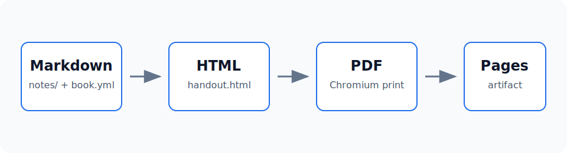

# Why Markdown Handout Builder

Markdown Handout Builder is a command-line tool for course handouts, internal tutorials, and long-form technical notes. It renders a group of plain Markdown files into an HTML reading version, then prints the same HTML through Playwright Chromium to produce the official PDF.

The core goals are simple:

- Keep the content repository small: `book.yml`, `notes/`, and optional local customization files.
- Let authors keep writing plain Markdown, without depending on Obsidian plugin syntax.
- Generate HTML and PDF from one rendering source.
- Let GitHub Actions publish a showcase to GitHub Pages and upload build artifacts.

==This document is the showcase.== It uses Markdown, math, footnotes, tables, image captions, multiple themes, and PDF table-of-contents page numbers generated by this package.

## Build Model

A handout has three practical inputs:

| File or directory | Role | Required in a note repo |
|---|---|---|
| `book.yml` | Metadata, chapter order, output paths, theme config | Yes |
| `notes/` | Markdown chapters and local assets | Yes |
| `templates/` | Custom CSS, cover fragments, back-cover fragments | Optional |
| `scripts/` | Build, validation, and PDF rendering scripts | No, provided by npm |

The pipeline can be described as:

$$
\text{handout.pdf} = \operatorname{print}(\operatorname{render}(\text{book.yml}, \text{notes}))
$$

`render` converts Markdown into HTML. `print` handles browser printing and PDF post-processing.

## When to Use It

This package is a good fit for:

1. Course handouts and revision notes.
2. Team operations manuals.
3. Product or engineering documents that need both web and PDF output.
4. Small knowledge bases that should publish to GitHub Pages without a full static-site framework.

If you need routing, search indexing, interactive components, or a blog engine, use a documentation-site framework. If you need a set of Markdown files to become one printable handout, this package stays deliberately narrow.
